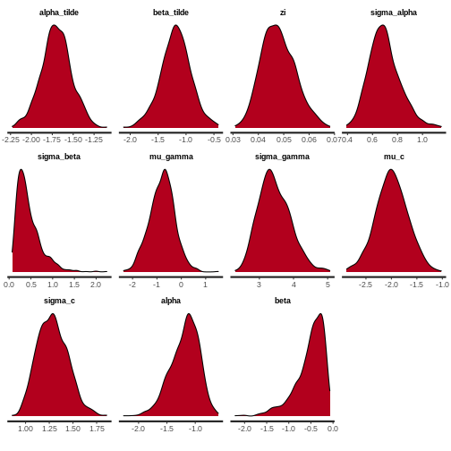
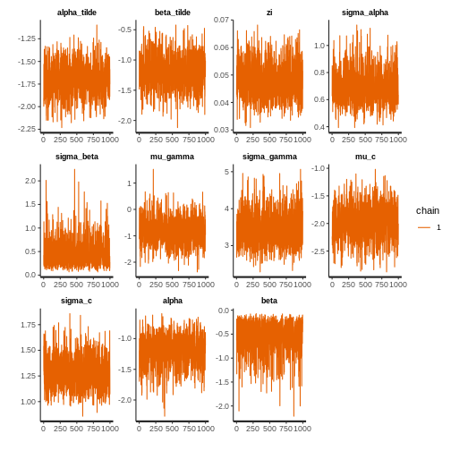
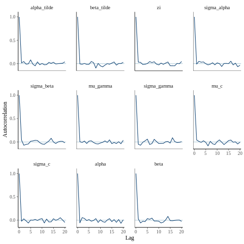

# Platform effect estimation

- [Load the data](#load-the-data)
  * [Model fit summary](#model-fit-summary)
  * [Gene specific platform effect](#gene-specific-platform-effect)
  * [Posterior predictive check](#posterior-predictive-check)
  * [Other model fitting diagnostics](#other-model-fitting-diagnostics)
- [Fit the Bayesian model](#fit-the-bayesian-model)
- [Inspect model fitting result](#inspect-model-fitting-result)
- [Save result for future use](#save-result-for-future-use)
- [Simulate spatial transcriptomics measurement](#simulate-spatial-transcriptomics-measurement)
- [Session Info](#session-info)
  
In this tutorial, we will go over the analysis of estimating platform effect between 
single cell RNA-seq and spatial transcriptomis technologies using gpsFISH. We estimate 
the platform effect by training a Bayesian model on scRNA-seq and spatial transcriptomics 
data with cell type annotation. The trained model can then be used to simulate spatial
transcriptomics data from scRNA-seq data.


First, let’s load libraries:


```r
library(gpsFISH)
library(ggplot2)
library(boot)             
library(bayesplot)       
#> This is bayesplot version 1.8.1
#> - Online documentation and vignettes at mc-stan.org/bayesplot
#> - bayesplot theme set to bayesplot::theme_default()
#>    * Does _not_ affect other ggplot2 plots
#>    * See ?bayesplot_theme_set for details on theme setting
library(ggpointdensity) 
library(viridis)          
#> Loading required package: viridisLite
library(deming)          
library(rstan)  
#> Loading required package: StanHeaders
#> rstan (Version 2.21.2, GitRev: 2e1f913d3ca3)
#> For execution on a local, multicore CPU with excess RAM we recommend calling
#> options(mc.cores = parallel::detectCores()).
#> To avoid recompilation of unchanged Stan programs, we recommend calling
#> rstan_options(auto_write = TRUE)
```


To avoid recompilation of unchanged Stan programs, we recommend calling

```r
rstan_options(auto_write = TRUE)
rstan_options(javascript=FALSE)
```


## Load the data

Next we will load the example scRNA-seq data, spatial transcriptomics data, and their corresponding cell type annotation information: 


```r
data(sc_count)
data(sc_cluster)
data(spatial_count)
data(spatial_cluster)
```


Let's take a quick look at the data:


```r
dim(sc_count)
#> [1] 19972   550

sc_count[1:5,1:5]
#>          1772071035_H02 1772066099_C11 1772067093_F03 1772067083_D10 1772067065_A12
#> Tspan12               2              0              0              0              0
#> Tshz1                 0              0              0              0             10
#> Fnbp1l                1              4              0              0              2
#> Adamts15              0              1              0              0              0
#> Cldn12                0              2              0              0              0

dim(sc_cluster)
#> [1] 550   2

sc_cluster[1:5,]
#>                     cell_name class_label
#> 1772071035_H02 1772071035_H02 Interneuron
#> 1772066099_C11 1772066099_C11 Interneuron
#> 1772067093_F03 1772067093_F03 Interneuron
#> 1772067083_D10 1772067083_D10 Interneuron
#> 1772067065_A12 1772067065_A12 Interneuron

table(sc_cluster$class_label)
#> 
#>             Astrocyte1             Astrocyte2           Endothelial2 Hippocampus_Excitatory            Interneuron 
#>                     50                     50                     50                     50                     50 
#>           Oligo_Mature               Oligo_MF                    Pvm      S1_Excitatory_L23     S1_Excitatory_L45a 
#>                     50                     50                     50                     50                     50 
#>                   Vsmc 
#>                     50

dim(spatial_count)
#> [1]  33 537

spatial_count[1:5,1:5]
#>         3092 3699 604 4928 4020
#> Gad2       2  102  46   77  122
#> Slc32a1    1   47  26   48   24
#> Crhbp      0   10   2    0  131
#> Cnr1       0    9  10    1    1
#> Vip        0   10   1    0    3

dim(spatial_cluster)
#> [1] 537   2

spatial_cluster[1:5,]
#>      cell_name class_label
#> 3092      3092 Interneuron
#> 3699      3699 Interneuron
#> 604        604 Interneuron
#> 4928      4928 Interneuron
#> 4020      4020 Interneuron

table(spatial_cluster$class_label)
#> 
#>             Astrocyte1             Astrocyte2           Endothelial2 Hippocampus_Excitatory            Interneuron 
#>                     50                     50                     50                     50                     50 
#>           Oligo_Mature               Oligo_MF                    Pvm      S1_Excitatory_L23     S1_Excitatory_L45a 
#>                     50                     50                     50                     50                     50 
#>                   Vsmc 
#>                     37
```


Here, we use the _Codeluppi_ dataset as an example. To reduce the computation time, the loaded example datasets are subsampled from their corresponding full datasets by keeping at most 50 cells for each cell type. For the subsampled example scRNA-seq data, we have 19972 genes and 550 cells, covering 11 cell types. For the subsampled example spatial transcriptomics data, we have 33 genes and 537 cells, also covering 11 cell types. 


Then we prepare other information that is needed for model fitting:


```r
#get overlapping cell types
unique_cluster_label=intersect(as.character(unique(sc_cluster[colnames(sc_count),]$class_label)), as.character(unique(spatial_cluster[colnames(spatial_count),]$class_label)))

#get overlapping genes
overlap_gene=intersect(unique(rownames(sc_count)),unique(rownames(spatial_count)))

#set up output folder
outputpath = "~/gpsFISH_walkthrough/simulation_training"
```


## Fit the Bayesian model

After having all the data, we can start to fit the model. To reduce the running time, we use variational inference for model fitting (`optimizer = "variational_inference"`). In addition, we set the number of iterations to 100 (`num.iter = 100`). Of note, this is just for demonstration purpose. For fitting the model on real data, it is suggested to use at least 2000 iterations if `optimizer = "sampling"` and 10000 iterations if `optimizer = "variational_inference"`. The code below will take a few minutes to finish. 


```r
simulation.params=simulation_training_ZINB(sc_count = sc_count,
                                           spatial_count = spatial_count,
                                           overlap_gene = overlap_gene,
                                           unique_cluster_label = unique_cluster_label,
                                           sc_cluster = sc_cluster,
                                           spatial_cluster = spatial_cluster,
                                           outputpath = outputpath,
                                           optimizer = "variational_inference",
                                           mcmc.check = FALSE,
                                           num.iter = 100,
                                           num.chain = 4,
                                           num.core = 4,
                                           saveplot = FALSE)
#> [1] "Prepare data"
#> [1] "Start model fitting"
#> Chain 1: ------------------------------------------------------------
#> Chain 1: EXPERIMENTAL ALGORITHM:
#> Chain 1:   This procedure has not been thoroughly tested and may be unstable
#> Chain 1:   or buggy. The interface is subject to change.
#> Chain 1: ------------------------------------------------------------
#> Chain 1: 
#> Chain 1: 
#> Chain 1: 
#> Chain 1: Gradient evaluation took 0.013262 seconds
#> Chain 1: 1000 transitions using 10 leapfrog steps per transition would take 132.62 seconds.
#> Chain 1: Adjust your expectations accordingly!
#> Chain 1: 
#> Chain 1: 
#> Chain 1: Begin eta adaptation.
#> Chain 1: Iteration:   1 / 250 [  0%]  (Adaptation)
#> Chain 1: Iteration:  50 / 250 [ 20%]  (Adaptation)
#> Chain 1: Iteration: 100 / 250 [ 40%]  (Adaptation)
#> Chain 1: Iteration: 150 / 250 [ 60%]  (Adaptation)
#> Chain 1: Iteration: 200 / 250 [ 80%]  (Adaptation)
#> Chain 1: Success! Found best value [eta = 1] earlier than expected.
#> Chain 1: 
#> Chain 1: Begin stochastic gradient ascent.
#> Chain 1:   iter             ELBO   delta_ELBO_mean   delta_ELBO_med   notes 
#> Chain 1:    100       -43091.258             1.000            1.000
#> Chain 1: Informational Message: The maximum number of iterations is reached! The algorithm may not have converged.
#> Chain 1: This variational approximation is not guaranteed to be meaningful.
#> Chain 1: 
#> Chain 1: Drawing a sample of size 1000 from the approximate posterior... 
#> Chain 1: COMPLETED.
#> Warning: Pareto k diagnostic value is 83.79. Resampling is disabled. Decreasing tol_rel_obj may help if variational
#> algorithm has terminated prematurely. Otherwise consider using sampling instead.
#> [1] "Return result"
```


## Inspect model fitting result

**Note**: because we only used 100 iterations, the model fit didn't converge. The inspections below are for demonstration purpose only.  

### Model fit summary

Let's take a look at the model fitting result. First, we plot the posterior distribution of variables in the Bayesian model:


```r
params2check = c("alpha_tilde", "beta_tilde", "zi", "sigma_alpha", "sigma_beta", "mu_gamma", "sigma_gamma", "mu_c", "sigma_c", "alpha", "beta")
rstan::stan_dens(simulation.params$distortion_model, pars = params2check)
```




### Gene specific platform effect

Estimated gene specific intercept $c_i$ and coefficient $\gamma_i$ are stored in the `c_i_full` and `gamma_i_full` slot:


```r
head(simulation.params$c_i_full)
#>               mean se_mean         sd      2.5%       25%       50%        75%      97.5% n_eff     khat
#> Cnr1    -2.2176241     NaN 0.21482822 -2.608461 -2.367627 -2.219475 -2.0759100 -1.7732028   NaN 83.81091
#> Slc32a1 -2.9374800     NaN 0.06544542 -3.068636 -2.980043 -2.935210 -2.8937775 -2.8101290   NaN 83.81402
#> Ctps    -1.4811216     NaN 0.25697162 -1.980050 -1.655125 -1.484560 -1.3077300 -0.9906093   NaN 83.89809
#> Gad2    -0.7962802     NaN 0.69323458 -2.203964 -1.249097 -0.805937 -0.3319873  0.5738135   NaN 84.03906
#> Crhbp   -3.7411983     NaN 0.06519461 -3.865151 -3.786765 -3.739190 -3.6948100 -3.6169735   NaN 83.77386
#> Cpne5   -3.0225351     NaN 0.32895840 -3.675909 -3.234548 -3.019975 -2.8101750 -2.3609190   NaN 83.77552

head(simulation.params$gamma_i_full)
#>               mean se_mean         sd         2.5%        25%        50%       75%      97.5% n_eff     khat
#> Cnr1     0.6976035     NaN   3.481918 0.0014804800 0.02269020 0.09388155 0.3472038   5.915228   NaN 83.66572
#> Slc32a1 38.3295666     NaN 382.280179 0.0003527466 0.04364100 0.36389150 2.9863300 212.942825   NaN 84.21173
#> Ctps     0.5733315     NaN   2.982933 0.0012869945 0.01592177 0.06934920 0.2734767   4.408956   NaN 83.89286
#> Gad2     8.2284129     NaN  70.863192 0.0004838992 0.02294635 0.13934550 0.8415438  42.482655   NaN 84.08245
#> Crhbp    4.1930229     NaN  13.284280 0.0373788125 0.34822600 1.04116500 3.2732150  27.790722   NaN 84.15793
#> Cpne5    1.0989488     NaN   3.402213 0.0104046740 0.08087045 0.24831950 0.8360097   7.414197   NaN 83.97412
```


### Posterior predictive check

Then we can perform posterior predictive check:


```r
#observed spatial transcriptomics data
obs = simulation.params$data2fit$sp.count

#simulated spatial transcriptomics data using draws from the posterior predictive distribution,
pred = rstan::extract(simulation.params$distortion_model, pars = "y_rep")[[1]]  #each row is one set of simulation from posterior predictive distribution

#QQ plot comparing observed vs. simulated spatial transcriptomics data
qqplot(obs, pred[1,], xlab="observed data", ylab=paste("simulated data", 1), main="observed vs. simulated spatial data")
graphics::abline(0,1)
```


We can also check the relationship between relative expression in scRNA-seq data and relative expression in observed vs. simulated spatial transcriptomics data:


```r
#calculate relative expression in scRNA-seq and observed spatial transcriptomics data
#scRNA-seq data:
sub_sc_count=sc_count[overlap_gene,]
prop_ik_sc=sapply(unique_cluster_label, gene_list=overlap_gene, relative_freq,
                  count_matrix=sub_sc_count,
                  cell_cluster_conversion=sc_cluster)
#spatial transcriptomics data:
sub_spatial_count=spatial_count[overlap_gene,]
prop_ik_spatial=sapply(unique_cluster_label, gene_list=overlap_gene, relative_freq,
                       count_matrix=sub_spatial_count,
                       cell_cluster_conversion=spatial_cluster)

#scatter plot of relative expression in scRNA-seq data vs. observed spatial transcriptomics data
densityscatter(x=data_transformation(as.numeric(as.matrix(prop_ik_sc)), "log", base=exp(1)), y=data_transformation(as.numeric(as.matrix(prop_ik_spatial)), "log", base=exp(1)),
                  xlab="relative expression in scRNA-seq (log)", ylab="relative expression in spatial data (log)", main = "original spatial data")

#calculate relative expression in simulated spatial transcriptomics data
simulation.params$data2fit$simu.sp.count = pred[1,]               #we choose one of the simulations as the simulated spatial count
temp=simulation.params$data2fit[,c("simu.sp.count", "gene", "cell")]
simu_spatial_count = stats::reshape(temp, idvar = "gene", timevar = "cell", direction = "wide")
rownames(simu_spatial_count)=simu_spatial_count$gene
simu_spatial_count=simu_spatial_count[,-1]
colnames(simu_spatial_count)=colnames(spatial_count)

prop_ik_spatial_simu=sapply(unique_cluster_label, gene_list=overlap_gene, relative_freq,
                            count_matrix=simu_spatial_count,
                            cell_cluster_conversion=spatial_cluster)

#scatter plot of relative expression in scRNA-seq data vs. simulated spatial transcriptomics data
densityscatter(x=data_transformation(as.numeric(as.matrix(prop_ik_sc)), "log", base=exp(1)), y=data_transformation(as.numeric(as.matrix(prop_ik_spatial_simu)), "log", base=exp(1)),
                 xlab="relative expression in scRNA-seq (log)", ylab="relative expression in spatial data (log)", main = "simulated spatial data")
```


### Other model fitting diagnostics

`simulation.params$distortion_model` is a `stanfit` object from the `rstan` package. Any diagnostic function that can be used on a `stanfit` object can be used on `simulation.params$distortion_model`. For example, we can make a trace plot to visualize the change of parameter vector over the iterations of one or many Markov chains:


```r
rstan::traceplot(simulation.params$distortion_model, pars = params2check)
```




We can also check the autocorrelation of each Markov chain:

```r
bayesplot::mcmc_acf(simulation.params$distortion_model, pars = params2check, lags = 20)
```




The plots are not that useful since we are using variational inference for model fitting. But the way these plots are generated is the same for model fitting using sampling. More diagnostic plot can be found in the package [bayesplot](https://mc-stan.org/bayesplot/articles/visual-mcmc-diagnostics.html)


**Note**: All the plots above will be automatically generated and outputted to `outputpath` if `saveplot = TRUE`


## Save result for future use

The size of `simulation.params` can be big given the size of input data and number of iterations. However, a large chunk of the information will not be used in future analysis. Therefore, we can trim the result and only keep the minimum amount of information that we will need for future use:


```r
#check the size of simulation.params
format(object.size(simulation.params), units = "Mb")
#> [1] "874 Mb"

#trim simulation.params
simulation.params.trimmed = simulation_training_ZINB_trim(simulation.params)

#check the size after trimming
format(object.size(simulation.params.trimmed), units = "Mb")
#> [1] "30 Mb"
```


Specifically, what is changed is that we replaced the `distortion_model` slot from `simulation.params`, which contains the full fitted Bayesian model, with the `posterior` slot in `simulation.params.trimmed`, which only contains the extracted samples of variables in the Bayesian model from their posterior distributions: 


```r
names(simulation.params)
#> [1] "distortion_model" "data2fit"         "model.summary"    "fixed.effect"     "c_i_full"         "gamma_i_full"    
#> [7] "lib.size"

names(simulation.params.trimmed)
#> [1] "data2fit"      "model.summary" "fixed.effect"  "c_i_full"      "gamma_i_full"  "lib.size"      "posterior"
```


## Simulate spatial transcriptomics measurement

After having the Bayesian model, we can use it to simulating spatial transcriptomics measurement for genes in the transcriptome using their expression information measured by scRNA-seq.

In order to do so, we need to calculate relative expression for each gene. 
This is the key input for simulating spatial transcriptomics measurement from scRNA-seq data.
To make relative expression consistent across datasets, 
we calculate it based on all genes in the transcriptome.


```r
#cluster-wise relative expression
relative_prop = list()
relative_prop[["cluster.average"]] = sapply(unique_cluster_label, gene_list=rownames(sc_count), relative_freq,
                                          count_matrix=sc_count,             
                                          cell_cluster_conversion=sc_cluster)
#individual cell level relative expression
relative_prop[["cell.level"]] = t(t(sc_count)/colSums(sc_count))
```

Then we can use it together with the Bayesian model as input to simulate spatial transcriptomics measurement.


```r
genes2simulate = sample(rownames(sc_count), 100)       #randomly select 100 genes to simulate their spatial transcriptomics measurement

class_label_per_cell = as.character(sc_cluster[colnames(sc_count),"class_label"])     #cell type for each cell

#simulate spatial transcriptomics data
simulate_sp_count = sc2spatial(gene_list = genes2simulate,
                               cell_list = colnames(sc_count),
                               cell_cluster_conversion = class_label_per_cell,
                               relative_prop = relative_prop,
                               sample_new_levels = "old_levels",
                               use_average_cluster_profiles = FALSE,
                               simulation_type = "Simulation",
                               simulation_parameter = simulation_params,
                               simulation_model = "ZINB")

dim(simulate_sp_count)
#> [1] 100 550

simulate_sp_count[1:5,1:5]
#>               1772071035_H02 1772066099_C11 1772067093_F03 1772067083_D10 1772067065_A12
#> Nefm                       0              1              0              1              2
#> Ap1b1                      7              1              0              0              5
#> Mir5126                    0              1              0              0              0
#> 1700092E19Rik              2              0              0              0              0
#> Ppa2                      54             26              1              1             26
```


## Session Info

```r
sessionInfo()
#> R version 4.1.2 (2021-11-01)
#> Platform: x86_64-pc-linux-gnu (64-bit)
#> Running under: Ubuntu 18.04.6 LTS
#> 
#> Matrix products: default
#> BLAS:   /usr/lib/x86_64-linux-gnu/blas/libblas.so.3.7.1
#> LAPACK: /usr/lib/x86_64-linux-gnu/lapack/liblapack.so.3.7.1
#> 
#> locale:
#>  [1] LC_CTYPE=en_US.UTF-8       LC_NUMERIC=C               LC_TIME=en_US.UTF-8        LC_COLLATE=en_US.UTF-8    
#>  [5] LC_MONETARY=en_US.UTF-8    LC_MESSAGES=en_US.UTF-8    LC_PAPER=en_US.UTF-8       LC_NAME=C                 
#>  [9] LC_ADDRESS=C               LC_TELEPHONE=C             LC_MEASUREMENT=en_US.UTF-8 LC_IDENTIFICATION=C       
#> 
#> attached base packages:
#> [1] stats     graphics  grDevices utils     datasets  methods   base     
#> 
#> other attached packages:
#>  [1] rstan_2.21.2         StanHeaders_2.21.0-7 deming_1.4           viridis_0.6.1        viridisLite_0.4.0   
#>  [6] ggpointdensity_0.1.0 bayesplot_1.8.1      boot_1.3-28          ggplot2_3.3.5        gpsFISH_0.1.0       
#> 
#> loaded via a namespace (and not attached):
#>  [1] Rcpp_1.0.7         prettyunits_1.1.1  ps_1.6.0           assertthat_0.2.1   digest_0.6.27      utf8_1.2.2        
#>  [7] V8_3.4.2           R6_2.5.0           plyr_1.8.6         ggridges_0.5.3     RcppZiggurat_0.1.6 stats4_4.1.2      
#> [13] evaluate_0.14      highr_0.9          pillar_1.7.0       rlang_1.0.2        curl_4.3.2         callr_3.7.0       
#> [19] rmarkdown_2.9      labeling_0.4.2     stringr_1.4.0      loo_2.4.1          munsell_0.5.0      compiler_4.1.2    
#> [25] xfun_0.24          pkgconfig_2.0.3    pkgbuild_1.2.0     htmltools_0.5.1.1  tidyselect_1.1.1   tibble_3.1.7      
#> [31] gridExtra_2.3      codetools_0.2-18   matrixStats_0.60.0 fansi_0.5.0        crayon_1.4.1       dplyr_1.0.7       
#> [37] withr_2.4.2        grid_4.1.2         jsonlite_1.7.2     gtable_0.3.0       lifecycle_1.0.0    DBI_1.1.1         
#> [43] magrittr_2.0.1     scales_1.1.1       Rfast_2.0.6        RcppParallel_5.1.4 cli_3.3.0          stringi_1.7.3     
#> [49] farver_2.1.0       reshape2_1.4.4     ellipsis_0.3.2     generics_0.1.0     vctrs_0.4.1        tools_4.1.2       
#> [55] glue_1.6.2         purrr_0.3.4        processx_3.5.2     parallel_4.1.2     yaml_2.2.1         inline_0.3.19     
#> [61] colorspace_2.0-2   knitr_1.33
```
